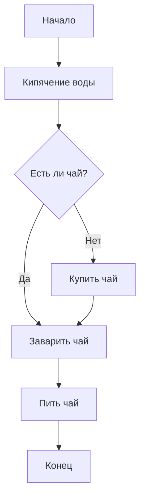
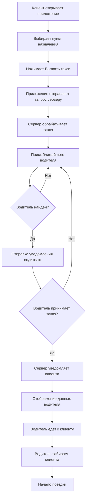
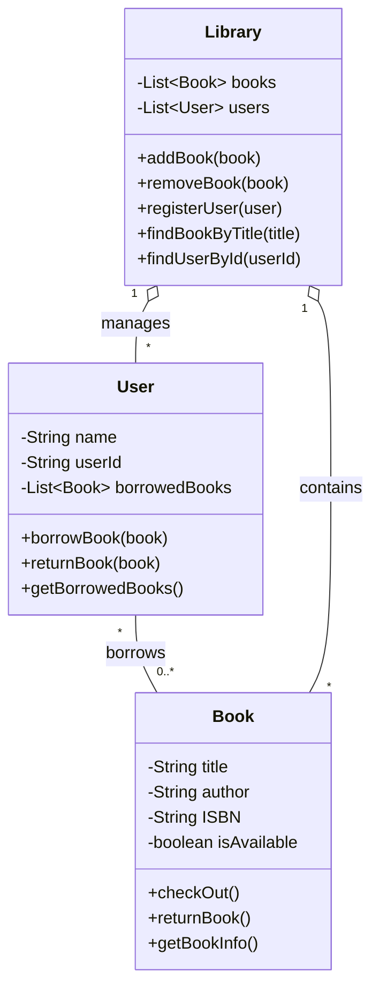
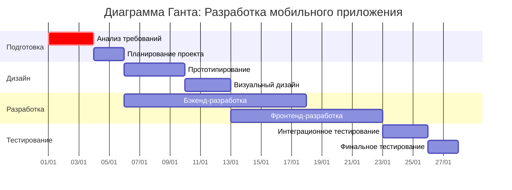
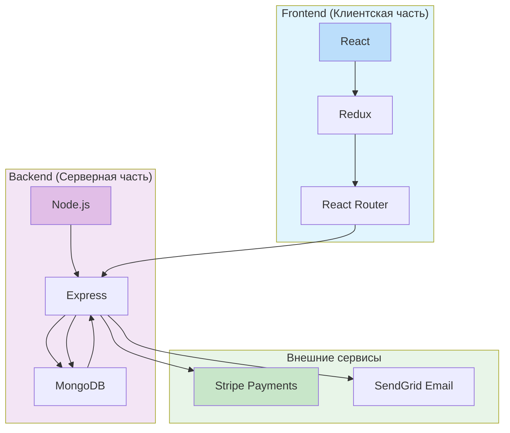
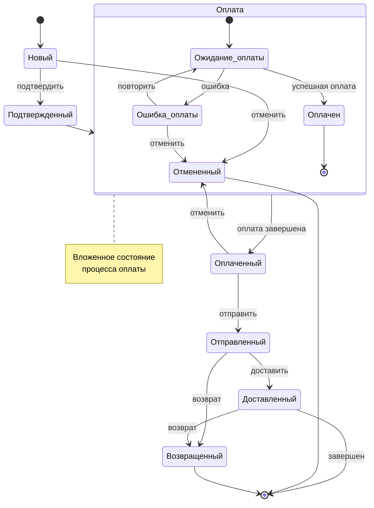

# Zadanie
# TEA

```mermaid
graph TD
    A[Начало] --> B[Кипячение воды]
    B --> C{Есть ли чай?}
    C -->|Да| D[Заварить чай]
    C -->|Нет| E[Купить чай]
    E --> D
    D --> F[Пить чай]
    F --> G[Конец]
```
# TAXI

```mermaid
graph TD
    A[Клиент открывает приложение] --> B[Выбирает пункт назначения]
    B --> C[Нажимает Вызвать такси]
    C --> D[Приложение отправляет запрос серверу]
    D --> E[Сервер обрабатывает заказ]
    E --> F[Поиск ближайшего водителя]
    F --> G{Водитель найден?}
    G -->|Нет| F
    G -->|Да| H[Отправка уведомления водителю]
    H --> I{Водитель принимает заказ?}
    I -->|Нет| F
    I -->|Да| J[Сервер уведомляет клиента]
    J --> K[Отображение данных водителя]
    K --> L[Водитель едет к клиенту]
    L --> M[Водитель забирает клиента]
    M --> N[Начало поездки]
```
# Bibliotec

```mermaid
classDiagram
    class Book {
        -String title
        -String author
        -String ISBN
        -boolean isAvailable
        +checkOut()
        +returnBook()
        +getBookInfo()
    }

    class User {
        -String name
        -String userId
        -List~Book~ borrowedBooks
        +borrowBook(book)
        +returnBook(book)
        +getBorrowedBooks()
    }

    class Library {
        -List~Book~ books
        -List~User~ users
        +addBook(book)
        +removeBook(book)
        +registerUser(user)
        +findBookByTitle(title)
        +findUserById(userId)
    }
    User "*" -- "0..*" Book : borrows
    Library "1" o-- "*" Book : contains
    Library "1" o-- "*" User : manages
```
# Ganta

```mermaid
gantt
    title Диаграмма Ганта: Разработка мобильного приложения
    dateFormat  YYYY-MM-DD
    axisFormat  %d/%m
    
    section Подготовка
    Анализ требований      :crit, prep1, 2024-01-01, 3d
    Планирование проекта   :prep2, after prep1, 2d
    
    section Дизайн
    Прототипирование       :design1, after prep2, 4d
    Визуальный дизайн      :design2, after design1, 3d
    
    section Разработка
    Бэкенд-разработка      :backend, after prep2, 12d
    Фронтенд-разработка    :frontend, after design2, 10d
    
    section Тестирование
    Интеграционное тестирование :test1, after backend frontend, 3d
    Финальное тестирование      :test2, after test1, 2d
```
# Graf z

```mermaid
graph TB
    subgraph Frontend["Frontend (Клиентская часть)"]
        A[React]
        B[Redux]
        C[React Router]
        A --> B
        B --> C
    end

    subgraph Backend["Backend (Серверная часть)"]
        D[Node.js]
        E[Express]
        F[MongoDB]
        D --> E
        E --> F
    end

    subgraph ExternalServices["Внешние сервисы"]
        G[Stripe Payments]
        H[SendGrid Email]
    end

    %% Связи между компонентами
    C --> E
    E --> G
    E --> H
    E --> F
    F --> E

    %% Стили для визуального разделения
    style Frontend fill:#e1f5fe
    style Backend fill:#f3e5f5
    style ExternalServices fill:#e8f5e8
    style A fill:#bbdefb
    style D fill:#e1bee7
    style G fill:#c8e6c9
```

# Диаграмма состояний: Заказ в интернет-магазине

```mermaid
stateDiagram-v2
    [*] --> Новый
    Новый --> Подтвержденный : подтвердить
    Новый --> Отмененный : отменить
    
    state Оплата {
        [*] --> Ожидание_оплаты
        Ожидание_оплаты --> Оплачен : успешная оплата
        Ожидание_оплаты --> Ошибка_оплаты : ошибка
        Ошибка_оплаты --> Ожидание_оплаты : повторить
        Ошибка_оплаты --> Отмененный : отменить
        Оплачен --> [*]
    }
    
    Подтвержденный --> Оплата
    Оплата --> Оплаченный : оплата завершена
    
    Оплаченный --> Отправленный : отправить
    Оплаченный --> Отмененный : отменить
    
    Отправленный --> Доставленный : доставить
    Отправленный --> Возвращенный : возврат
    
    Доставленный --> Возвращенный : возврат
    Доставленный --> [*] : завершен
    
    Отмененный --> [*]
    Возвращенный --> [*]

    note right of Оплата
      Вложенное состояние
      процесса оплаты
    end note
```