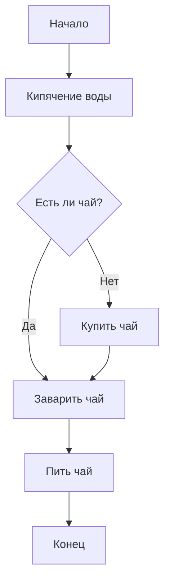
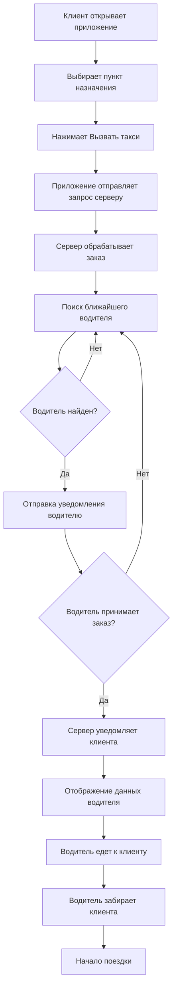

# Zadanie
# TEA

```mermaid
graph TD
    A[Начало] --> B[Кипячение воды]
    B --> C{Есть ли чай?}
    C -->|Да| D[Заварить чай]
    C -->|Нет| E[Купить чай]
    E --> D
    D --> F[Пить чай]
    F --> G[Конец]
```
# TAXI

```mermaid
graph TD
    A[Клиент открывает приложение] --> B[Выбирает пункт назначения]
    B --> C[Нажимает Вызвать такси]
    C --> D[Приложение отправляет запрос серверу]
    D --> E[Сервер обрабатывает заказ]
    E --> F[Поиск ближайшего водителя]
    F --> G{Водитель найден?}
    G -->|Нет| F
    G -->|Да| H[Отправка уведомления водителю]
    H --> I{Водитель принимает заказ?}
    I -->|Нет| F
    I -->|Да| J[Сервер уведомляет клиента]
    J --> K[Отображение данных водителя]
    K --> L[Водитель едет к клиенту]
    L --> M[Водитель забирает клиента]
    M --> N[Начало поездки]
```