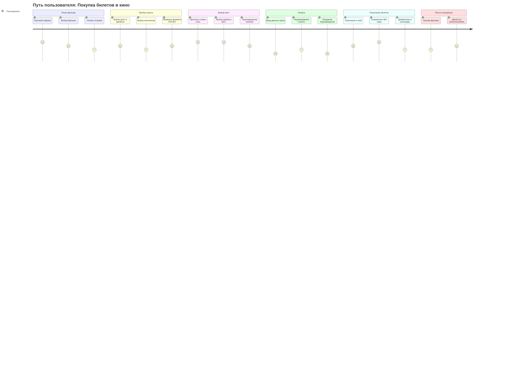
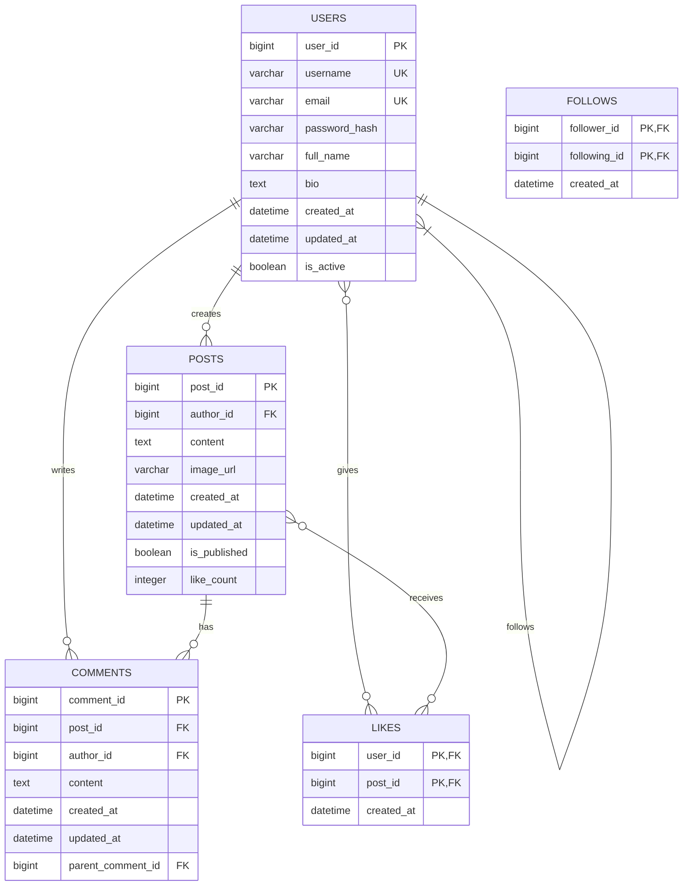
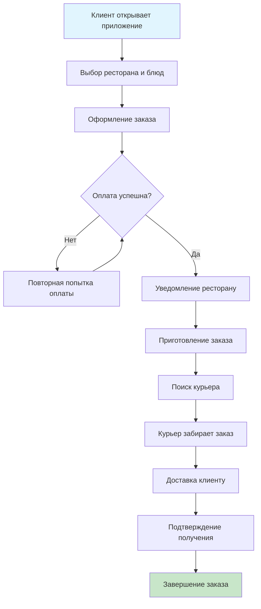
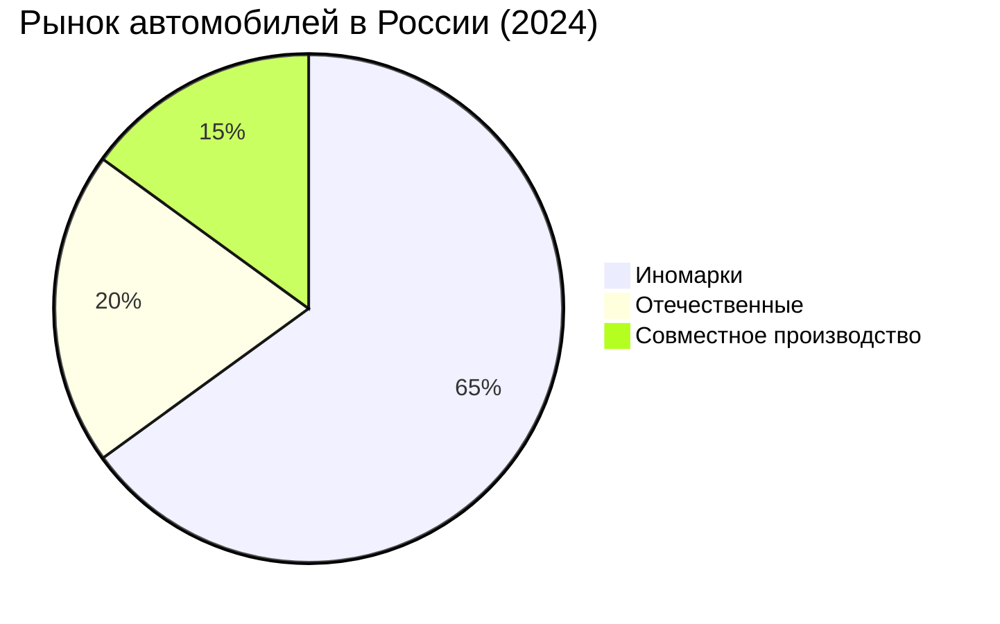

# Zadanie
# TEA

# TAXI

# Bibliotec

# Ganta

# Graf z

# Диаграмма состояний: Заказ в интернет-магазине

# Покупка билетов в кино

# ER-диаграмма: Социальная сеть

# Сервис доставки еды

# Диаграмма: Пропорции автомобилей на российском рынке

